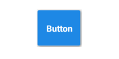

# MaterialDesignLibrary
<article class="markdown-body entry-content" itemprop="text">

<h1><a id="user-content-material-design-android-library" class="anchor" href="#material-design-android-library" aria-hidden="true"><svg aria-hidden="true" class="octicon octicon-link" height="16" role="img" version="1.1" viewBox="0 0 16 16" width="16"><path d="M4 9h1v1h-1c-1.5 0-3-1.69-3-3.5s1.55-3.5 3-3.5h4c1.45 0 3 1.69 3 3.5 0 1.41-0.91 2.72-2 3.25v-1.16c0.58-0.45 1-1.27 1-2.09 0-1.28-1.02-2.5-2-2.5H4c-0.98 0-2 1.22-2 2.5s1 2.5 2 2.5z m9-3h-1v1h1c1 0 2 1.22 2 2.5s-1.02 2.5-2 2.5H9c-0.98 0-2-1.22-2-2.5 0-0.83 0.42-1.64 1-2.09v-1.16c-1.09 0.53-2 1.84-2 3.25 0 1.81 1.55 3.5 3 3.5h4c1.45 0 3-1.69 3-3.5s-1.5-3.5-3-3.5z"></path></svg></a>Material Design Android Library</h1>

<ul>
<li><a href="#howtouse">How to use</a></li>
<li><a href="#components">Components</a>

<ul>
<li><a href="#buttons">Buttons</a>

<ul>
<li><a href="#flat-button">Flat Button</a></li>
<li><a href="#rectangle-button">Rectangle Button</a></li>
<li><a href="#float-button">Float Button</a></li>
<li><a href="#float-small-button">Float small button</a></li>
</ul></li>
<li><a href="#switches">Switches</a>

<ul>
<li><a href="#checkbox">CheckBox</a></li>
<li><a href="#switch">Switch</a></li>
</ul></li>
<li><a href="#progress-indicators">Progress indicators</a>

<ul>
<li><a href="#progress-bar-circula-rindeterminate">Progress bar circular indeterminate</a></li>
<li><a href="#progress-bar-indeterminate">Progress bar indeterminate</a></li>
<li><a href="#progress-bar-indeterminate-determinate">Progress bar indeterminate determinate</a></li>
<li><a href="#progress-bar-determinate">Progress bar determinate</a></li>
<li><a href="#slider">Slider</a></li>
<li><a href="#slider-with-number-indicator">Slider with number indicator</a></li>
</ul></li>
</ul></li>
<li><a href="#widgets">Widgets</a>

<ul>
<li><a href="#snackbar">SnackBar</a></li>
<li><a href="#dialog">Dialog</a></li>
<li><a href="#color-selector">Color selector</a></li>
</ul></li>
</ul>

<h2><a id="user-content-how-to-use" class="anchor" href="#how-to-use" aria-hidden="true"><svg aria-hidden="true" class="octicon octicon-link" height="16" role="img" version="1.1" viewBox="0 0 16 16" width="16"><path d="M4 9h1v1h-1c-1.5 0-3-1.69-3-3.5s1.55-3.5 3-3.5h4c1.45 0 3 1.69 3 3.5 0 1.41-0.91 2.72-2 3.25v-1.16c0.58-0.45 1-1.27 1-2.09 0-1.28-1.02-2.5-2-2.5H4c-0.98 0-2 1.22-2 2.5s1 2.5 2 2.5z m9-3h-1v1h1c1 0 2 1.22 2 2.5s-1.02 2.5-2 2.5H9c-0.98 0-2-1.22-2-2.5 0-0.83 0.42-1.64 1-2.09v-1.16c-1.09 0.53-2 1.84-2 3.25 0 1.81 1.55 3.5 3 3.5h4c1.45 0 3-1.69 3-3.5s-1.5-3.5-3-3.5z"></path></svg></a>How to use</h2>

If you want use this library, you only have to download MaterialDesign project, import it into your workspace and add the project as a library in your android project settings.

If you prefer it, you can use the gradle dependency, you have to add these lines in your build.gradle file:

<pre>repositories {
    maven {
        url "https://jitpack.io"
    }
}

dependencies {
    compile 'com.github.IvanGarza07:MaterialDesignLibrary:1.0.2'
}</pre>

If you use other libraries requiring nineoldandroids and appcompat-v7 like <a href="https://github.com/rengwuxian/MaterialEditText/">MaterialEditText</a> or MaterialSpinner make sure to exclude them :

<pre>compile ('com.github.IvanGarza07:MaterialDesignLibrary:1.0.2'){
        exclude group: 'com.nineoldandroids', module: 'library'
        exclude group: 'com.android.support', module: 'appcompat-v7'
}</pre>

Some components have custom attributes, if you want use them, you must add this line in your xml file in the first component:

<pre>&lt;RelativeLayout xmlns:android="http://schemas.android.com/apk/res/android"
    xmlns:materialdesign="http://schemas.android.com/apk/res-auto"
    android:layout_width="match_parent"
    android:layout_height="match_parent"
    &gt;
&lt;/RelativeLayout&gt;</pre>

<blockquote>

If you are going to use a ScrollView, it is recommended that you use the CustomScrollView provided in this library to avoid problems with the custom components.
To use this component:

<pre>&lt;com.ivan.materialdesign.views.ScrollView 
   xmlns:android="http://schemas.android.com/apk/res/android"
   xmlns:materialdesign="http://schemas.android.com/apk/res-auto"
   android:id="@+id/scroll"
   android:layout_width="match_parent"
   android:layout_height="match_parent"&gt;
&lt;/com.gc.materialdesign.views.ScrollView&gt;</pre>

</blockquote>

<h2><a id="user-content-components" class="anchor" href="#components" aria-hidden="true"><svg aria-hidden="true" class="octicon octicon-link" height="16" role="img" version="1.1" viewBox="0 0 16 16" width="16"><path d="M4 9h1v1h-1c-1.5 0-3-1.69-3-3.5s1.55-3.5 3-3.5h4c1.45 0 3 1.69 3 3.5 0 1.41-0.91 2.72-2 3.25v-1.16c0.58-0.45 1-1.27 1-2.09 0-1.28-1.02-2.5-2-2.5H4c-0.98 0-2 1.22-2 2.5s1 2.5 2 2.5z m9-3h-1v1h1c1 0 2 1.22 2 2.5s-1.02 2.5-2 2.5H9c-0.98 0-2-1.22-2-2.5 0-0.83 0.42-1.64 1-2.09v-1.16c-1.09 0.53-2 1.84-2 3.25 0 1.81 1.55 3.5 3 3.5h4c1.45 0 3-1.69 3-3.5s-1.5-3.5-3-3.5z"></path></svg></a>Components</h2>

<h4><a id="user-content-buttons" class="anchor" href="#buttons" aria-hidden="true"><svg aria-hidden="true" class="octicon octicon-link" height="16" role="img" version="1.1" viewBox="0 0 16 16" width="16"><path d="M4 9h1v1h-1c-1.5 0-3-1.69-3-3.5s1.55-3.5 3-3.5h4c1.45 0 3 1.69 3 3.5 0 1.41-0.91 2.72-2 3.25v-1.16c0.58-0.45 1-1.27 1-2.09 0-1.28-1.02-2.5-2-2.5H4c-0.98 0-2 1.22-2 2.5s1 2.5 2 2.5z m9-3h-1v1h1c1 0 2 1.22 2 2.5s-1.02 2.5-2 2.5H9c-0.98 0-2-1.22-2-2.5 0-0.83 0.42-1.64 1-2.09v-1.16c-1.09 0.53-2 1.84-2 3.25 0 1.81 1.55 3.5 3 3.5h4c1.45 0 3-1.69 3-3.5s-1.5-3.5-3-3.5z"></path></svg></a>Buttons</h4>

<h6><a id="user-content-flat-button" class="anchor" href="#flat-button" aria-hidden="true"><svg aria-hidden="true" class="octicon octicon-link" height="16" role="img" version="1.1" viewBox="0 0 16 16" width="16"><path d="M4 9h1v1h-1c-1.5 0-3-1.69-3-3.5s1.55-3.5 3-3.5h4c1.45 0 3 1.69 3 3.5 0 1.41-0.91 2.72-2 3.25v-1.16c0.58-0.45 1-1.27 1-2.09 0-1.28-1.02-2.5-2-2.5H4c-0.98 0-2 1.22-2 2.5s1 2.5 2 2.5z m9-3h-1v1h1c1 0 2 1.22 2 2.5s-1.02 2.5-2 2.5H9c-0.98 0-2-1.22-2-2.5 0-0.83 0.42-1.64 1-2.09v-1.16c-1.09 0.53-2 1.84-2 3.25 0 1.81 1.55 3.5 3 3.5h4c1.45 0 3-1.69 3-3.5s-1.5-3.5-3-3.5z"></path></svg></a>Flat Button</h6>

<pre>&lt;com.ivan.materialdesign.views.ButtonFlat
                android:id="@+id/buttonflat"
                android:layout_width="wrap_content"
                android:layout_height="wrap_content"
                android:background="#1E88E5"
                android:text="Button" /&gt;</pre>

<h6><a id="user-content-rectangle-button" class="anchor" href="#rectangle-button" aria-hidden="true"><svg aria-hidden="true" class="octicon octicon-link" height="16" role="img" version="1.1" viewBox="0 0 16 16" width="16"><path d="M4 9h1v1h-1c-1.5 0-3-1.69-3-3.5s1.55-3.5 3-3.5h4c1.45 0 3 1.69 3 3.5 0 1.41-0.91 2.72-2 3.25v-1.16c0.58-0.45 1-1.27 1-2.09 0-1.28-1.02-2.5-2-2.5H4c-0.98 0-2 1.22-2 2.5s1 2.5 2 2.5z m9-3h-1v1h1c1 0 2 1.22 2 2.5s-1.02 2.5-2 2.5H9c-0.98 0-2-1.22-2-2.5 0-0.83 0.42-1.64 1-2.09v-1.16c-1.09 0.53-2 1.84-2 3.25 0 1.81 1.55 3.5 3 3.5h4c1.45 0 3-1.69 3-3.5s-1.5-3.5-3-3.5z"></path></svg></a>Rectangle Button</h6>

<pre>&lt;com.ivan.materialdesign.views.ButtonRectangle
                android:id="@+id/button"
                android:layout_width="wrap_content"
                android:layout_height="wrap_content"
                android:background="#1E88E5"
                android:text="Button" /&gt;</pre>

<h6><a id="user-content-float-button" class="anchor" href="#float-button" aria-hidden="true"><svg aria-hidden="true" class="octicon octicon-link" height="16" role="img" version="1.1" viewBox="0 0 16 16" width="16"><path d="M4 9h1v1h-1c-1.5 0-3-1.69-3-3.5s1.55-3.5 3-3.5h4c1.45 0 3 1.69 3 3.5 0 1.41-0.91 2.72-2 3.25v-1.16c0.58-0.45 1-1.27 1-2.09 0-1.28-1.02-2.5-2-2.5H4c-0.98 0-2 1.22-2 2.5s1 2.5 2 2.5z m9-3h-1v1h1c1 0 2 1.22 2 2.5s-1.02 2.5-2 2.5H9c-0.98 0-2-1.22-2-2.5 0-0.83 0.42-1.64 1-2.09v-1.16c-1.09 0.53-2 1.84-2 3.25 0 1.81 1.55 3.5 3 3.5h4c1.45 0 3-1.69 3-3.5s-1.5-3.5-3-3.5z"></path></svg></a>Float Button</h6>

<blockquote>

It is recommended to put this component in the right-bottom of the screen. To use this component write this code in your xml file.
If you don`t want to start this component with animation set the animate attribute to false.
Put your icon in the icon attribute to set the drawable icon for this component.

</blockquote>

<pre>&lt;RelativeLayout xmlns:android="http://schemas.android.com/apk/res/android"
    xmlns:materialdesign="http://schemas.android.com/apk/res-auto"
    android:layout_width="match_parent"
    android:layout_height="match_parent"
    &gt;
    &lt;!-- ... XML CODE --&gt;
    &lt;com.ivan.materialdesign.views.ButtonFloat
                android:id="@+id/buttonFloat"
                android:layout_width="wrap_content"
                android:layout_height="wrap_content"
                android:layout_alignParentRight="true"
                android:layout_alignParentBottom="true"
                android:layout_marginRight="24dp"
                android:background="#1E88E5"
                materialdesign:animate="true"
                materialdesign:iconDrawable="@drawable/ic_action_new" /&gt;
&lt;/RelativeLayout&gt;</pre>

<h6><a id="user-content-float-small-button" class="anchor" href="#float-small-button" aria-hidden="true"><svg aria-hidden="true" class="octicon octicon-link" height="16" role="img" version="1.1" viewBox="0 0 16 16" width="16"><path d="M4 9h1v1h-1c-1.5 0-3-1.69-3-3.5s1.55-3.5 3-3.5h4c1.45 0 3 1.69 3 3.5 0 1.41-0.91 2.72-2 3.25v-1.16c0.58-0.45 1-1.27 1-2.09 0-1.28-1.02-2.5-2-2.5H4c-0.98 0-2 1.22-2 2.5s1 2.5 2 2.5z m9-3h-1v1h1c1 0 2 1.22 2 2.5s-1.02 2.5-2 2.5H9c-0.98 0-2-1.22-2-2.5 0-0.83 0.42-1.64 1-2.09v-1.16c-1.09 0.53-2 1.84-2 3.25 0 1.81 1.55 3.5 3 3.5h4c1.45 0 3-1.69 3-3.5s-1.5-3.5-3-3.5z"></path></svg></a>Float small button</h6>

<pre>&lt;com.ivan.materialdesign.views.ButtonFloatSmall
                android:id="@+id/buttonFloatSmall"
                android:layout_width="wrap_content"
                android:layout_height="wrap_content"
                android:background="#1E88E5"
                materialdesign:iconDrawable="@drawable/ic_action_new" /&gt;</pre>

<h4><a id="user-content-switches" class="anchor" href="#switches" aria-hidden="true"><svg aria-hidden="true" class="octicon octicon-link" height="16" role="img" version="1.1" viewBox="0 0 16 16" width="16"><path d="M4 9h1v1h-1c-1.5 0-3-1.69-3-3.5s1.55-3.5 3-3.5h4c1.45 0 3 1.69 3 3.5 0 1.41-0.91 2.72-2 3.25v-1.16c0.58-0.45 1-1.27 1-2.09 0-1.28-1.02-2.5-2-2.5H4c-0.98 0-2 1.22-2 2.5s1 2.5 2 2.5z m9-3h-1v1h1c1 0 2 1.22 2 2.5s-1.02 2.5-2 2.5H9c-0.98 0-2-1.22-2-2.5 0-0.83 0.42-1.64 1-2.09v-1.16c-1.09 0.53-2 1.84-2 3.25 0 1.81 1.55 3.5 3 3.5h4c1.45 0 3-1.69 3-3.5s-1.5-3.5-3-3.5z"></path></svg></a>Switches</h4>

<h6><a id="user-content-checkbox" class="anchor" href="#checkbox" aria-hidden="true"><svg aria-hidden="true" class="octicon octicon-link" height="16" role="img" version="1.1" viewBox="0 0 16 16" width="16"><path d="M4 9h1v1h-1c-1.5 0-3-1.69-3-3.5s1.55-3.5 3-3.5h4c1.45 0 3 1.69 3 3.5 0 1.41-0.91 2.72-2 3.25v-1.16c0.58-0.45 1-1.27 1-2.09 0-1.28-1.02-2.5-2-2.5H4c-0.98 0-2 1.22-2 2.5s1 2.5 2 2.5z m9-3h-1v1h1c1 0 2 1.22 2 2.5s-1.02 2.5-2 2.5H9c-0.98 0-2-1.22-2-2.5 0-0.83 0.42-1.64 1-2.09v-1.16c-1.09 0.53-2 1.84-2 3.25 0 1.81 1.55 3.5 3 3.5h4c1.45 0 3-1.69 3-3.5s-1.5-3.5-3-3.5z"></path></svg></a>CheckBox</h6>

<pre>&lt;com.ivan.materialdesign.views.CheckBox
                android:id="@+id/checkBox"
                android:layout_width="wrap_content"
                android:layout_height="wrap_content"
                android:background="#1E88E5"
                materialdesign:check="true" /&gt;</pre>

<h6><a id="user-content-switch" class="anchor" href="#switch" aria-hidden="true"><svg aria-hidden="true" class="octicon octicon-link" height="16" role="img" version="1.1" viewBox="0 0 16 16" width="16"><path d="M4 9h1v1h-1c-1.5 0-3-1.69-3-3.5s1.55-3.5 3-3.5h4c1.45 0 3 1.69 3 3.5 0 1.41-0.91 2.72-2 3.25v-1.16c0.58-0.45 1-1.27 1-2.09 0-1.28-1.02-2.5-2-2.5H4c-0.98 0-2 1.22-2 2.5s1 2.5 2 2.5z m9-3h-1v1h1c1 0 2 1.22 2 2.5s-1.02 2.5-2 2.5H9c-0.98 0-2-1.22-2-2.5 0-0.83 0.42-1.64 1-2.09v-1.16c-1.09 0.53-2 1.84-2 3.25 0 1.81 1.55 3.5 3 3.5h4c1.45 0 3-1.69 3-3.5s-1.5-3.5-3-3.5z"></path></svg></a>Switch</h6>

<pre>&lt;com.ivan.materialdesign.views.Switch
                android:id="@+id/switchView"
                android:layout_width="wrap_content"
                android:layout_height="wrap_content"
                android:background="#1E88E5"
                materialdesign:check="true" /&gt;</pre>

<h4><a id="user-content-progress-indicators" class="anchor" href="#progress-indicators" aria-hidden="true"><svg aria-hidden="true" class="octicon octicon-link" height="16" role="img" version="1.1" viewBox="0 0 16 16" width="16"><path d="M4 9h1v1h-1c-1.5 0-3-1.69-3-3.5s1.55-3.5 3-3.5h4c1.45 0 3 1.69 3 3.5 0 1.41-0.91 2.72-2 3.25v-1.16c0.58-0.45 1-1.27 1-2.09 0-1.28-1.02-2.5-2-2.5H4c-0.98 0-2 1.22-2 2.5s1 2.5 2 2.5z m9-3h-1v1h1c1 0 2 1.22 2 2.5s-1.02 2.5-2 2.5H9c-0.98 0-2-1.22-2-2.5 0-0.83 0.42-1.64 1-2.09v-1.16c-1.09 0.53-2 1.84-2 3.25 0 1.81 1.55 3.5 3 3.5h4c1.45 0 3-1.69 3-3.5s-1.5-3.5-3-3.5z"></path></svg></a>Progress indicators</h4>

<h6><a id="user-content-progress-bar-circular-indeterminate" class="anchor" href="#progress-bar-circular-indeterminate" aria-hidden="true"><svg aria-hidden="true" class="octicon octicon-link" height="16" role="img" version="1.1" viewBox="0 0 16 16" width="16"><path d="M4 9h1v1h-1c-1.5 0-3-1.69-3-3.5s1.55-3.5 3-3.5h4c1.45 0 3 1.69 3 3.5 0 1.41-0.91 2.72-2 3.25v-1.16c0.58-0.45 1-1.27 1-2.09 0-1.28-1.02-2.5-2-2.5H4c-0.98 0-2 1.22-2 2.5s1 2.5 2 2.5z m9-3h-1v1h1c1 0 2 1.22 2 2.5s-1.02 2.5-2 2.5H9c-0.98 0-2-1.22-2-2.5 0-0.83 0.42-1.64 1-2.09v-1.16c-1.09 0.53-2 1.84-2 3.25 0 1.81 1.55 3.5 3 3.5h4c1.45 0 3-1.69 3-3.5s-1.5-3.5-3-3.5z"></path></svg></a>Progress bar circular indeterminate</h6>

<pre>&lt;com.ivan.materialdesign.views.ProgressBarCircularIndeterminate
                android:id="@+id/progressBarCircularIndeterminate"
                android:layout_width="32dp"
                android:layout_height="32dp"
                android:background="#1E88E5" /&gt;</pre>

<h6><a id="user-content-progress-bar-indeterminate" class="anchor" href="#progress-bar-indeterminate" aria-hidden="true"><svg aria-hidden="true" class="octicon octicon-link" height="16" role="img" version="1.1" viewBox="0 0 16 16" width="16"><path d="M4 9h1v1h-1c-1.5 0-3-1.69-3-3.5s1.55-3.5 3-3.5h4c1.45 0 3 1.69 3 3.5 0 1.41-0.91 2.72-2 3.25v-1.16c0.58-0.45 1-1.27 1-2.09 0-1.28-1.02-2.5-2-2.5H4c-0.98 0-2 1.22-2 2.5s1 2.5 2 2.5z m9-3h-1v1h1c1 0 2 1.22 2 2.5s-1.02 2.5-2 2.5H9c-0.98 0-2-1.22-2-2.5 0-0.83 0.42-1.64 1-2.09v-1.16c-1.09 0.53-2 1.84-2 3.25 0 1.81 1.55 3.5 3 3.5h4c1.45 0 3-1.69 3-3.5s-1.5-3.5-3-3.5z"></path></svg></a>Progress bar indeterminate</h6>

<pre>&lt;com.ivan.materialdesign.views.ProgressBarIndeterminate
                android:id="@+id/progressBarIndeterminate"
                android:layout_width="fill_parent"
                android:layout_height="wrap_content"
                android:background="#1E88E5" /&gt;</pre>

<h6><a id="user-content-progress-bar-indeterminate-determinate" class="anchor" href="#progress-bar-indeterminate-determinate" aria-hidden="true"><svg aria-hidden="true" class="octicon octicon-link" height="16" role="img" version="1.1" viewBox="0 0 16 16" width="16"><path d="M4 9h1v1h-1c-1.5 0-3-1.69-3-3.5s1.55-3.5 3-3.5h4c1.45 0 3 1.69 3 3.5 0 1.41-0.91 2.72-2 3.25v-1.16c0.58-0.45 1-1.27 1-2.09 0-1.28-1.02-2.5-2-2.5H4c-0.98 0-2 1.22-2 2.5s1 2.5 2 2.5z m9-3h-1v1h1c1 0 2 1.22 2 2.5s-1.02 2.5-2 2.5H9c-0.98 0-2-1.22-2-2.5 0-0.83 0.42-1.64 1-2.09v-1.16c-1.09 0.53-2 1.84-2 3.25 0 1.81 1.55 3.5 3 3.5h4c1.45 0 3-1.69 3-3.5s-1.5-3.5-3-3.5z"></path></svg></a>Progress bar indeterminate determinate</h6>

<pre>&lt;com.ivan.materialdesign.views.ProgressBarIndeterminateDeterminate
                android:id="@+id/progressBarIndeterminateDeterminate"
                android:layout_width="fill_parent"
                android:layout_height="wrap_content"
                android:background="#1E88E5" /&gt;</pre>

<blockquote>

If you begin progrees, you only have to set progress it

<pre>progressBarIndeterminateDeterminate.setProgress(progress);</pre>

</blockquote>

<h6><a id="user-content-progress-bar-determinate" class="anchor" href="#progress-bar-determinate" aria-hidden="true"><svg aria-hidden="true" class="octicon octicon-link" height="16" role="img" version="1.1" viewBox="0 0 16 16" width="16"><path d="M4 9h1v1h-1c-1.5 0-3-1.69-3-3.5s1.55-3.5 3-3.5h4c1.45 0 3 1.69 3 3.5 0 1.41-0.91 2.72-2 3.25v-1.16c0.58-0.45 1-1.27 1-2.09 0-1.28-1.02-2.5-2-2.5H4c-0.98 0-2 1.22-2 2.5s1 2.5 2 2.5z m9-3h-1v1h1c1 0 2 1.22 2 2.5s-1.02 2.5-2 2.5H9c-0.98 0-2-1.22-2-2.5 0-0.83 0.42-1.64 1-2.09v-1.16c-1.09 0.53-2 1.84-2 3.25 0 1.81 1.55 3.5 3 3.5h4c1.45 0 3-1.69 3-3.5s-1.5-3.5-3-3.5z"></path></svg></a>Progress bar determinate</h6>

<pre>&lt;com.ivan.materialdesign.views.ProgressBarDeterminate
                android:id="@+id/progressDeterminate"
                android:layout_width="fill_parent"
                android:layout_height="wrap_content"
                android:background="#1E88E5" /&gt;</pre>

<blockquote>

You can custom max and min progress values with <code>materialdesign:max="50"</code> and <code>materialdesign:min="25"</code> attributes.

</blockquote>

<h6><a id="user-content-slider" class="anchor" href="#slider" aria-hidden="true"><svg aria-hidden="true" class="octicon octicon-link" height="16" role="img" version="1.1" viewBox="0 0 16 16" width="16"><path d="M4 9h1v1h-1c-1.5 0-3-1.69-3-3.5s1.55-3.5 3-3.5h4c1.45 0 3 1.69 3 3.5 0 1.41-0.91 2.72-2 3.25v-1.16c0.58-0.45 1-1.27 1-2.09 0-1.28-1.02-2.5-2-2.5H4c-0.98 0-2 1.22-2 2.5s1 2.5 2 2.5z m9-3h-1v1h1c1 0 2 1.22 2 2.5s-1.02 2.5-2 2.5H9c-0.98 0-2-1.22-2-2.5 0-0.83 0.42-1.64 1-2.09v-1.16c-1.09 0.53-2 1.84-2 3.25 0 1.81 1.55 3.5 3 3.5h4c1.45 0 3-1.69 3-3.5s-1.5-3.5-3-3.5z"></path></svg></a>Slider</h6>

<pre>&lt;com.ivan.materialdesign.views.Slider
                android:id="@+id/slider"
                android:layout_width="fill_parent"
                android:layout_height="wrap_content"
                android:background="#1E88E5"
                materialdesign:max="50"
                materialdesign:min="0"
                 /&gt;</pre>

<h6><a id="user-content-slider-with-number-indicator" class="anchor" href="#slider-with-number-indicator" aria-hidden="true"><svg aria-hidden="true" class="octicon octicon-link" height="16" role="img" version="1.1" viewBox="0 0 16 16" width="16"><path d="M4 9h1v1h-1c-1.5 0-3-1.69-3-3.5s1.55-3.5 3-3.5h4c1.45 0 3 1.69 3 3.5 0 1.41-0.91 2.72-2 3.25v-1.16c0.58-0.45 1-1.27 1-2.09 0-1.28-1.02-2.5-2-2.5H4c-0.98 0-2 1.22-2 2.5s1 2.5 2 2.5z m9-3h-1v1h1c1 0 2 1.22 2 2.5s-1.02 2.5-2 2.5H9c-0.98 0-2-1.22-2-2.5 0-0.83 0.42-1.64 1-2.09v-1.16c-1.09 0.53-2 1.84-2 3.25 0 1.81 1.55 3.5 3 3.5h4c1.45 0 3-1.69 3-3.5s-1.5-3.5-3-3.5z"></path></svg></a>Slider with number indicator</h6>

<pre>&lt;com.ivan.materialdesign.views.Slider
                android:id="@+id/slider"
                android:layout_width="fill_parent"
                android:layout_height="wrap_content"
                android:background="#1E88E5"
                materialdesign:max="50"
                materialdesign:min="0"
                materialdesign:showNumberIndicator="true"/&gt;</pre>

<h2><a id="user-content-widgets" class="anchor" href="#widgets" aria-hidden="true"><svg aria-hidden="true" class="octicon octicon-link" height="16" role="img" version="1.1" viewBox="0 0 16 16" width="16"><path d="M4 9h1v1h-1c-1.5 0-3-1.69-3-3.5s1.55-3.5 3-3.5h4c1.45 0 3 1.69 3 3.5 0 1.41-0.91 2.72-2 3.25v-1.16c0.58-0.45 1-1.27 1-2.09 0-1.28-1.02-2.5-2-2.5H4c-0.98 0-2 1.22-2 2.5s1 2.5 2 2.5z m9-3h-1v1h1c1 0 2 1.22 2 2.5s-1.02 2.5-2 2.5H9c-0.98 0-2-1.22-2-2.5 0-0.83 0.42-1.64 1-2.09v-1.16c-1.09 0.53-2 1.84-2 3.25 0 1.81 1.55 3.5 3 3.5h4c1.45 0 3-1.69 3-3.5s-1.5-3.5-3-3.5z"></path></svg></a>Widgets</h2>

<h4><a id="user-content-snackbar" class="anchor" href="#snackbar" aria-hidden="true"><svg aria-hidden="true" class="octicon octicon-link" height="16" role="img" version="1.1" viewBox="0 0 16 16" width="16"><path d="M4 9h1v1h-1c-1.5 0-3-1.69-3-3.5s1.55-3.5 3-3.5h4c1.45 0 3 1.69 3 3.5 0 1.41-0.91 2.72-2 3.25v-1.16c0.58-0.45 1-1.27 1-2.09 0-1.28-1.02-2.5-2-2.5H4c-0.98 0-2 1.22-2 2.5s1 2.5 2 2.5z m9-3h-1v1h1c1 0 2 1.22 2 2.5s-1.02 2.5-2 2.5H9c-0.98 0-2-1.22-2-2.5 0-0.83 0.42-1.64 1-2.09v-1.16c-1.09 0.53-2 1.84-2 3.25 0 1.81 1.55 3.5 3 3.5h4c1.45 0 3-1.69 3-3.5s-1.5-3.5-3-3.5z"></path></svg></a>SnackBar</h4>

<pre>SnackBar snackbar = new SnackBar(Activity activity, String text, String buttonText, View.OnClickListener onClickListener);
snackbar.show();</pre>

<blockquote>

If you don't want to show the button, put <code>null</code> in <code>buttonText</code> attribute

</blockquote>

<h4><a id="user-content-dialog" class="anchor" href="#dialog" aria-hidden="true"><svg aria-hidden="true" class="octicon octicon-link" height="16" role="img" version="1.1" viewBox="0 0 16 16" width="16"><path d="M4 9h1v1h-1c-1.5 0-3-1.69-3-3.5s1.55-3.5 3-3.5h4c1.45 0 3 1.69 3 3.5 0 1.41-0.91 2.72-2 3.25v-1.16c0.58-0.45 1-1.27 1-2.09 0-1.28-1.02-2.5-2-2.5H4c-0.98 0-2 1.22-2 2.5s1 2.5 2 2.5z m9-3h-1v1h1c1 0 2 1.22 2 2.5s-1.02 2.5-2 2.5H9c-0.98 0-2-1.22-2-2.5 0-0.83 0.42-1.64 1-2.09v-1.16c-1.09 0.53-2 1.84-2 3.25 0 1.81 1.55 3.5 3 3.5h4c1.45 0 3-1.69 3-3.5s-1.5-3.5-3-3.5z"></path></svg></a>Dialog</h4>

<pre>Dialog dialog = new Dialog(Context context,String title, String message);
dialog.show();</pre>

<blockquote>

You can set the accept and cancel button on the event listener or change it's text

<pre>// Set accept click listenner
dialog.setOnAcceptButtonClickListener(View.OnClickListener onAcceptButtonClickListener);
// Set cancel click listenner
dialog.setOnCancelButtonClickListener(View.OnClickListener onCancelButtonClickListener);
// Acces to accept button
ButtonFlat acceptButton = dialog.getButtonAccept();
// Acces to cancel button
ButtonFlat cancelButton = dialog.getButtonCancel();</pre>

</blockquote>

<h4><a id="user-content-color-selector" class="anchor" href="#color-selector" aria-hidden="true"><svg aria-hidden="true" class="octicon octicon-link" height="16" role="img" version="1.1" viewBox="0 0 16 16" width="16"><path d="M4 9h1v1h-1c-1.5 0-3-1.69-3-3.5s1.55-3.5 3-3.5h4c1.45 0 3 1.69 3 3.5 0 1.41-0.91 2.72-2 3.25v-1.16c0.58-0.45 1-1.27 1-2.09 0-1.28-1.02-2.5-2-2.5H4c-0.98 0-2 1.22-2 2.5s1 2.5 2 2.5z m9-3h-1v1h1c1 0 2 1.22 2 2.5s-1.02 2.5-2 2.5H9c-0.98 0-2-1.22-2-2.5 0-0.83 0.42-1.64 1-2.09v-1.16c-1.09 0.53-2 1.84-2 3.25 0 1.81 1.55 3.5 3 3.5h4c1.45 0 3-1.69 3-3.5s-1.5-3.5-3-3.5z"></path></svg></a>Color selector</h4>

<pre>ColorSelector colorSelector = new ColorSelector(Context context,int intialColor, OnColorSelectedListener onColorSelectedListener);
colorSelector.show();</pre>

<h1><a id="user-content-materialspinner" class="anchor" href="#materialspinner" aria-hidden="true"><svg aria-hidden="true" class="octicon octicon-link" height="16" role="img" version="1.1" viewBox="0 0 16 16" width="16"><path d="M4 9h1v1h-1c-1.5 0-3-1.69-3-3.5s1.55-3.5 3-3.5h4c1.45 0 3 1.69 3 3.5 0 1.41-0.91 2.72-2 3.25v-1.16c0.58-0.45 1-1.27 1-2.09 0-1.28-1.02-2.5-2-2.5H4c-0.98 0-2 1.22-2 2.5s1 2.5 2 2.5z m9-3h-1v1h1c1 0 2 1.22 2 2.5s-1.02 2.5-2 2.5H9c-0.98 0-2-1.22-2-2.5 0-0.83 0.42-1.64 1-2.09v-1.16c-1.09 0.53-2 1.84-2 3.25 0 1.81 1.55 3.5 3 3.5h4c1.45 0 3-1.69 3-3.5s-1.5-3.5-3-3.5z"></path></svg></a>MaterialSpinner</h1>

Spinner with Material Design - Down to API 9

This library provides you a Spinner with the Material style. You can use it like any regular Spinner. 
Add floating label text, hint and error messages.

<h2><a id="user-content-screenshots" class="anchor" href="#screenshots" aria-hidden="true"><svg aria-hidden="true" class="octicon octicon-link" height="16" role="img" version="1.1" viewBox="0 0 16 16" width="16"><path d="M4 9h1v1h-1c-1.5 0-3-1.69-3-3.5s1.55-3.5 3-3.5h4c1.45 0 3 1.69 3 3.5 0 1.41-0.91 2.72-2 3.25v-1.16c0.58-0.45 1-1.27 1-2.09 0-1.28-1.02-2.5-2-2.5H4c-0.98 0-2 1.22-2 2.5s1 2.5 2 2.5z m9-3h-1v1h1c1 0 2 1.22 2 2.5s-1.02 2.5-2 2.5H9c-0.98 0-2-1.22-2-2.5 0-0.83 0.42-1.64 1-2.09v-1.16c-1.09 0.53-2 1.84-2 3.25 0 1.81 1.55 3.5 3 3.5h4c1.45 0 3-1.69 3-3.5s-1.5-3.5-3-3.5z"></path></svg></a>Screenshots</h2>

<h2><a id="user-content-usages" class="anchor" href="#usages" aria-hidden="true"><svg aria-hidden="true" class="octicon octicon-link" height="16" role="img" version="1.1" viewBox="0 0 16 16" width="16"><path d="M4 9h1v1h-1c-1.5 0-3-1.69-3-3.5s1.55-3.5 3-3.5h4c1.45 0 3 1.69 3 3.5 0 1.41-0.91 2.72-2 3.25v-1.16c0.58-0.45 1-1.27 1-2.09 0-1.28-1.02-2.5-2-2.5H4c-0.98 0-2 1.22-2 2.5s1 2.5 2 2.5z m9-3h-1v1h1c1 0 2 1.22 2 2.5s-1.02 2.5-2 2.5H9c-0.98 0-2-1.22-2-2.5 0-0.83 0.42-1.64 1-2.09v-1.16c-1.09 0.53-2 1.84-2 3.25 0 1.81 1.55 3.5 3 3.5h4c1.45 0 3-1.69 3-3.5s-1.5-3.5-3-3.5z"></path></svg></a>Usages</h2>

In the xml : 

<pre>&lt;com.ivan.materialdesign.widgets.MaterialSpinner
        android:id="@+id/spinner"
        android:layout_width="fill_parent"
        android:layout_height="wrap_content" 
        app:ms_multiline="false"
        app:ms_hint="hint"
        app:ms_enableFloatingLabel="false"
        app:ms_enableErrorLabel="false"
        app:ms_floatingLabelText="floating label"
        app:ms_baseColor="@color/base"
        app:ms_highlightColor="@color/highlight"
        app:ms_errorColor="@color/error"
        app:ms_typeface="typeface.ttf"
        app:ms_thickness="2dp"
        app:ms_hintColor="@color/hint"
        app:ms_arrowColor="@color/arrow"
        app:ms_arrowSize="16dp"
        app:ms_alignLabels="false"
        app:ms_floatingLabelColor="@color/floating_label"/&gt;</pre>

You can set a hint and a floating label text. If no floating label text is provided, the hint will be set instead.

Java side, you use it like a regular spinner, setting an adapter to it.

<pre> String[] ITEMS = {"Item 1", "Item 2", "Item 3", "Item 4", "Item 5", "Item 6"};
 ArrayAdapter&lt;String&gt; adapter = new ArrayAdapter&lt;String&gt;(this, android.R.layout.simple_spinner_item, ITEMS);
 adapter.setDropDownViewResource(android.R.layout.simple_spinner_dropdown_item);
 spinner = (MaterialSpinner) findViewById(R.id.spinner);
 spinner.setAdapter(adapter);</pre>

If you need to set an error message, you can do it the same way than with an EditText :

<pre> //Activate
 spinner.setError("Error");
 //Desactivate
 spinner.setError(null);</pre>

You can choose to have a scrolling animation or to set the error message on multiple lines with the "ms_multiline" attribute in xml (default is true).

</article>
